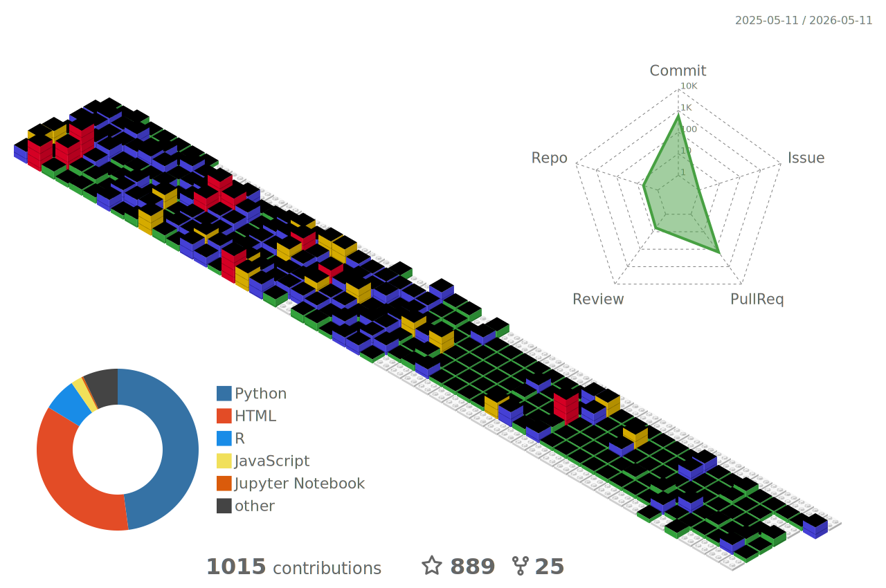

# About Me

I am a Data Analyst with experience in digital analytics, teaching, research, and project management. Master in Administration at the Federal Fluminense University (UFF), with a period of international mobility at the Faculty of Economics of the University of Coimbra (FEUC). I also have an MBA in Business Management and Information Systems from the Federal Fluminense University (UFF) and a bachelor's degree in Information Systems from Estácio de Sá University (UNESA).

## Technical Skills
  
  
  
  
  

## Tools
  
  
  
  
  
  
  
  
  
  
  
  
  
  
 
  
## Education

- Master's in Administration, Federal Fluminense University (UFF)
- Exchange in Economy, Faculty of Economics at the University of Coimbra (FEUC)
- MBA in Business Management and Information Systems, Federal Fluminense University (UFF)
- Bachelor's in Information Systems, Estácio de Sá University (UNESA)

## Certificates

- [Google Data Analytics Certificate](https://coursera.org/share/b6d3274cd84d289d1e27369090b5ab67)
- [Python Fundamentos para Análise de Dados](https://mycourse.app/WJSU)
- [Curso avançado do Google Analytics](https://analytics.google.com/analytics/academy/certificate/JSm-vTK0SXepYxvlKhNLSg)
- [Google Analytics for Power Users](https://analytics.google.com/analytics/academy/certificate/scDodWXUTICVYaZUTpgRMg)
- [Microsoft Power BI Para Data Science](https://mycourse.app/DnsFP6sWei8rLEwG9)
- [A Crash Course in Data Science](https://coursera.org/share/4c7a34e6929e3439c5373fdbf3bda69c)
- [Advanced Google Tag Manager](https://www.linkedin.com/learning/certificates/017f3eba570c9389e371a85bff55daeb5ef17070f026ce0c5fb6a3ed31112800)
- [Fundamentos para Análise de Dados por Microsoft e LinkedIn](https://www.linkedin.com/learning/certificates/2b48dadfebe956addd13dfed3b2093baea5c784e28f702792afad2050f81d121)
- [Become a Data Scientist](https://www.linkedin.com/learning/certificates/e748837b29ef4cdb99a9d892c3a37eefb7208a0784cef0a4792c1431c98edab1)
- [Métricas de Negócios Digitais](https://app.kajabi.com/certificates/70000fb0)

## Contact

## [🔙 profile-views-counter](https://github.com/melogabriel/profile-views-counter)

### :octocat: [melogabriel](https://github.com/melogabriel/melogabriel)

## Stats

**The language charts are based on recent commits.*

