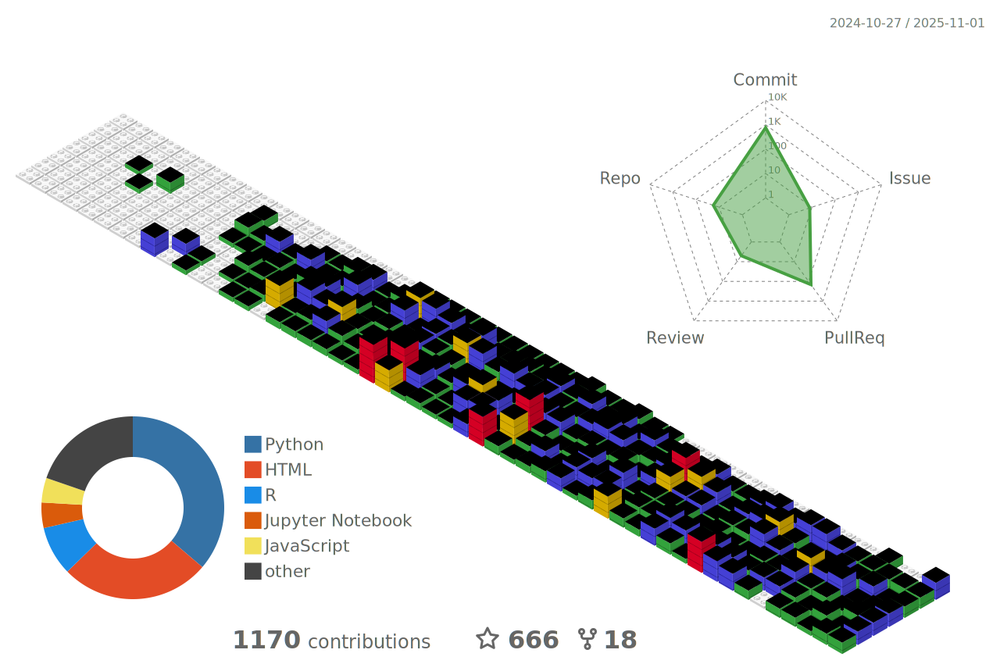

# About Me

I'm a Data Analyst with a strong professional background in Python, R, and cloud platforms leveraging data for insights. 
I'm also a passionate advocate and participant in open game development, retro gaming, modding culture, and the open-source community. 
Constantly exploring, learning, and connecting the dots between data and interactive experiences.

	
 

## Technical Skills

	
  
  
  
  

## Tools

  
  
  
  
  
  
  
  
  
  
  
  
  
  
 
  

## GitHub Dashboard

	

 

>**These statistics are presented in UTC time, which may not correspond to my local time. Contributions may be a few hours out of date.*

>**The language charts are based on recent commits.*

**Profile Views Counter**

### :octocat: [melogabriel](https://github.com/melogabriel/melogabriel)

	
Click to expand table

	<h2>:calendar: Year Page Views Table</h2>
<table>
	<tr>
		<th>
			Last Updated
		</th>
		<th>
			Unique
		</th>
		<th>
			Count
		</th>
	</tr>
	<tr>
		<td>
			<code>2025/6/1</code>
		</td>
		<td>
			<code>1</code>
		</td>
		<td>
			<code>1</code>
		</td>
	</tr>
	<tr>
		<td>
			<code>2025/5/1</code>
		</td>
		<td>
			<code>13</code>
		</td>
		<td>
			<code>62</code>
		</td>
	</tr>
	<tr>
		<td>
			<code>2025/4/1</code>
		</td>
		<td>
			<code>14</code>
		</td>
		<td>
			<code>314</code>
		</td>
	</tr>
	<tr>
		<td>
			<code>2025/3/1</code>
		</td>
		<td>
			<code>15</code>
		</td>
		<td>
			<code>98</code>
		</td>
	</tr>
	<tr>
		<td>
			<code>2025/2/1</code>
		</td>
		<td>
			<code>17</code>
		</td>
		<td>
			<code>174</code>
		</td>
	</tr>
	<tr>
		<td>
			<code>2025/1/1</code>
		</td>
		<td>
			<code>0</code>
		</td>
		<td>
			<code>0</code>
		</td>
	</tr>
	<tr>
		<td>
			<code>2024/12/1</code>
		</td>
		<td>
			<code>0</code>
		</td>
		<td>
			<code>0</code>
		</td>
	</tr>
	<tr>
		<td>
			<code>2024/11/1</code>
		</td>
		<td>
			<code>0</code>
		</td>
		<td>
			<code>0</code>
		</td>
	</tr>
	<tr>
		<td>
			<code>2024/10/1</code>
		</td>
		<td>
			<code>0</code>
		</td>
		<td>
			<code>0</code>
		</td>
	</tr>
	<tr>
		<td>
			<code>2024/9/1</code>
		</td>
		<td>
			<code>0</code>
		</td>
		<td>
			<code>0</code>
		</td>
	</tr>
	<tr>
		<td>
			<code>2024/8/1</code>
		</td>
		<td>
			<code>0</code>
		</td>
		<td>
			<code>0</code>
		</td>
	</tr>
	<tr>
		<td>
			<code>2024/7/1</code>
		</td>
		<td>
			<code>0</code>
		</td>
		<td>
			<code>0</code>
		</td>
	</tr>
	<tr>
		<td>
			<code>2024/6/1</code>
		</td>
		<td>
			<code>0</code>
		</td>
		<td>
			<code>0</code>
		</td>
	</tr>
</table>

<small><i>Last updated on 2025/6/3 12:20 PM UTC</i></small>

## GitHub Summary Metrics Card

Click to Expand

  

    
  

